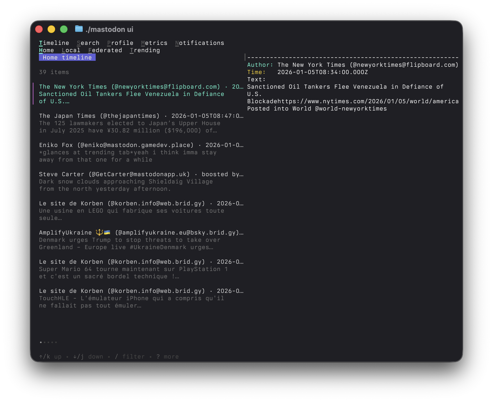

# Mastodon CLI (Go)



Minimal Go CLI and TUI for Mastodon. Supports OAuth login, timeline browsing, notifications, and reading your own posts.

## Features

- OAuth authorization code flow (OOB redirect)
- CLI: home timeline and your own posts (with pagination up to 800)
- TUI: timeline modes (Home/Local/Federated/Trending), notifications, metrics, profile, and a search placeholder
- Local config storage with secure permissions

## Installation

```bash
go build -o mastodon ./cmd/mastodon
```

## Usage

Log in and authorize the app:

```bash
./mastodon login --instance mastodon.social
```

Fetch the latest posts from your home timeline:

```bash
./mastodon timeline --limit 10
```

Fetch local, federated, or trending timelines:

```bash
./mastodon timeline --limit 10 --type local
./mastodon timeline --limit 10 --type federated
./mastodon timeline --limit 10 --type trending
```

Fetch your own posts:

```bash
./mastodon posts --limit 10
```

Fetch grouped notifications:

```bash
./mastodon notifications --limit 10
```

Fetch engagement metrics:

```bash
./mastodon metrics --range 7
./mastodon metrics --range 30
```

Show help:

```bash
./mastodon help
```

Launch the TUI:

```bash
./mastodon ui
```

## TUI shortcuts

- `tab` / `shift+tab`: switch top-level tabs
- `t` / `s` / `p` / `m` / `n`: jump to Timeline / Search / Profile / Metrics / Notifications
- Timeline modes: `h` (Home), `l` (Local), `f` (Federated), `g` (Trending), `r` (refresh)
- Metrics ranges: `7` (7 days), `3` (30 days), `r` (refresh)

## Configuration

Config is stored at `~/.config/mastodon-cli/config.json` and includes:

- `instance` (e.g. `mastodon.social`)
- `client_id` and `client_secret`
- `access_token`
- `redirect_uri` (defaults to `urn:ietf:wg:oauth:2.0:oob`)

File permissions are set to `0600`.

## Commands

- `login --instance <domain> [--force]`
  - Registers the OAuth app if needed, then prompts for the authorization code.
  - `--force` re-registers the app even if one is already stored.
- `timeline --limit <n> [--type home|local|federated|trending]`
  - Reads a timeline. `n` must be 1-40.
- `posts --limit <n> [--boosts] [--replies]`
  - Reads your own posts. By default boosts and replies are excluded. Supports pagination up to 800 posts and shows progress for larger requests.
- `notifications --limit <n>`
  - Reads grouped notifications. `n` must be 1-40.
- `metrics --range <7|30>`
  - Aggregates follows/likes/boosts per day from notifications.
- `ui`
  - Launches the TUI.

## Quick smoke tests

```bash
./mastodon login --instance mastodon.social
./mastodon timeline --limit 5 --type home
./mastodon timeline --limit 5 --type local
./mastodon timeline --limit 5 --type federated
./mastodon timeline --limit 5 --type trending
./mastodon posts --limit 5
./mastodon notifications --limit 5
./mastodon metrics --range 7
./mastodon ui
```

## API Notes

This CLI follows the Mastodon API docs:

- App registration: `POST /api/v1/apps`
- OAuth authorization: `GET /oauth/authorize`
- Token exchange: `POST /oauth/token`
- Home timeline: `GET /api/v1/timelines/home`
- Local timeline: `GET /api/v1/timelines/public?local=true`
- Federated timeline: `GET /api/v1/timelines/public`
- Trending: `GET /api/v1/trends/statuses`
- Notifications (grouped): `GET /api/v2/notifications`

Scopes: the CLI requests `read`, which is sufficient for home timeline access.
